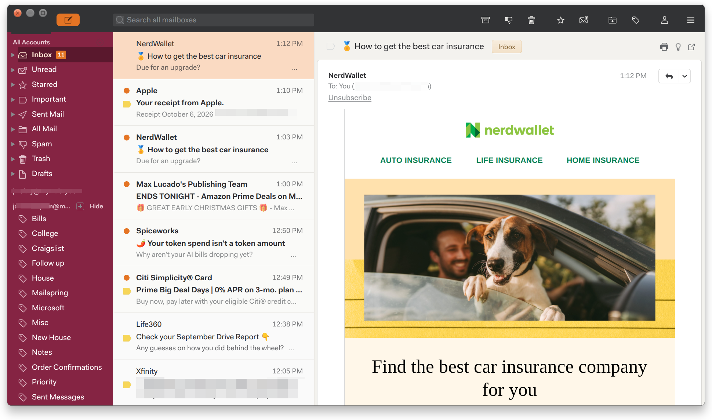

# Hokie Matcha — Mailspring theme

Matcha-style layout in Chicago Maroon (#861F41), Burnt Orange (#E5751F) and Hokie Stone gray.



## Install
1. Clone the repo:
   ```
   git clone https://github.com/<your-username>/hokie-matcha-mailspring-theme.git
   ```
2. In Mailspring, open Edit → Install Theme… and choose the `hokie-matcha-mailspring-theme` folder.
3. Edit → Change Theme… → Hokie Matcha.

Installed copy lives in `~/.config/Mailspring/packages/hokie-matcha-mailspring-theme` (Snap: `~/snap/mailspring/common/packages/hokie-matcha-mailspring-theme`).

## License
MIT. See LICENSE.md.

## Editing
- Colors: `styles/ui-variables.less`
- Component overrides: `styles/index.less`
- Reload after edits: switch to another theme and back (Edit → Change Theme…).

